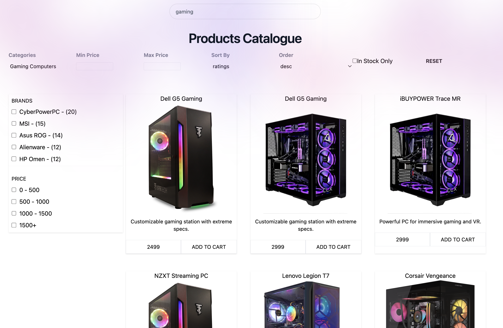

# E-Commerce Products Page with Elasticsearch



This repository implements an e-commerce platform with a focus on efficient data ingestion and search functionality.

Key highlights include:

- **Elasticsearch**: Powers the search functionality.
- **Kibana**: on top of elasticsearch
- **Postgres**: db to store products/categories
- **Kafka**: Enables event-driven product ingestion.
- **Redis**: Optimizes image handling.
- **Concurent Processing**: Efficiently processes product data from CSV uploads.

## CSV Product Upload Processing Flow

1. Upload product data using /upload.html
2. once the file is uploaded, rows are streamed using a read stream and parse with `fast-csv`

```typescript
export const parseAndStreamCsvFromPath = (filePath: string) => {
  return createReadStream(filePath).pipe(parse({ headers: true, delimiter: ',', quote: "'" }));
};
```

3. read the csv stream and batch rows, once we reach batchSize, we start processing the first batch

```typescript
for await (const row of csvStream) {
  rowsBatch.push(row);
  skuStash.push(row['sku']);
  if (rowsBatch.length == batchSize) {
    await processBatch();
    rowsBatch = [];
  }
}
```

4. to process a batch, we concurrently download images and wait for all settled.

5. we insert all products with successfull image download in the db

6. if a mass insert fails, we default on oneByOne

```typescript
export const batchInsertProducts = async (products: IProductDTO[]): Promise<IBatchProductInsertResponse> => {
  const response: IBatchProductInsertResponse = {
    success: 0,
    errors: [],
  };
  try {
    // await productRepo.insert(products);
    await productRepo.upsert(products, {
      conflictPaths: ['sku'],
    });
    response.success = products.length;
    return response;
  } catch (error) {
    return await insertOneByOne(products);
  }
};
```

Key Considerations

- Image Caching:
  - Images are cached locally to minimize redundant downloads. Cached images are reused if the same URL appears within 2 minutes.
- Error Handling:
  - Failed image downloads are retried individually to isolate failures.
- Scalability:
  - Kafka ensures asynchronous and decoupled processing.
  - Elasticsearch provides scalable search capabilities for large datasets.
